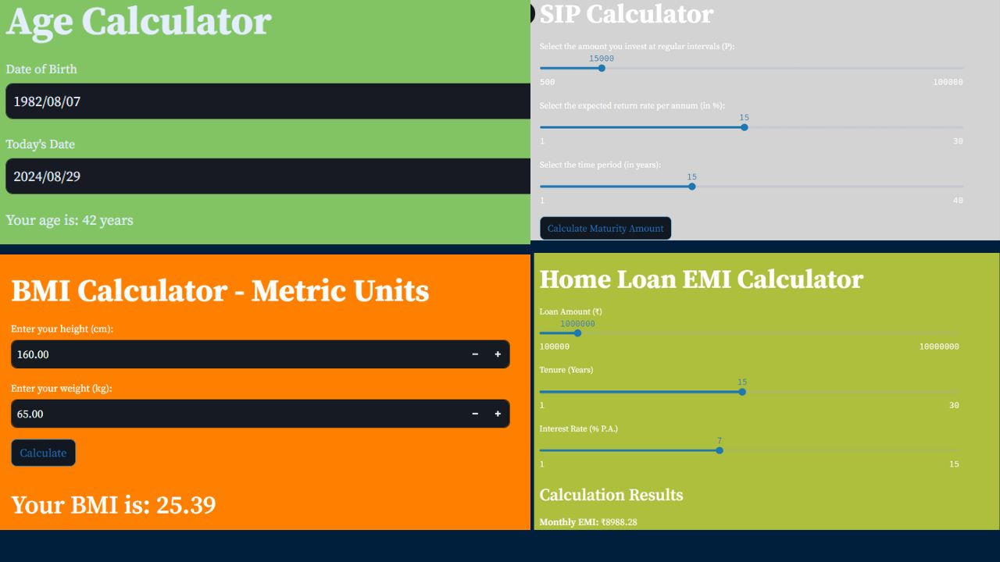

# streamlit-Projects
## Exploring Exciting Projects with Streamlit: Building Interactive Apps


# Table of Contents

- [Overview](#overview)
- [Installation](#Installation)
- [Usage](#Usage)
- [Contribution](#contribution)
- [License](#license)
- [Contact](#contact)

## Overview 

Dive into the world of Streamlit as we explore various exciting projects and applications. 
Learn how to build interactive and visually appealing apps with ease using Streamlit's powerful features. 
From data visualization to machine learning integrations, discover how this tool can elevate your projects. 
Perfect for developers and data scientists looking to enhance their workflow. Watch now to get inspired and start building!




## Installation

1. Clone this repository to your build machine using:

```bash
  git clone https://github.com/alexvatti/streamlit-Projects.git
```
2. Navigate to the project directory:

```bash
  cd streamlit-Projects
```
3. Install the required dependencies using pip:

```bash
  pip install -r requirements.txt
```

## Usage

1. Run the Streamlit app by executing:
```bash
streamlit run app.py
```


2.The web app will open in your browser where you can enter the texts/numbers.

## Contribution

Feel free to contribute and enhance the project!

## License
This project is licensed under the [MIT License](LICENSE).

## Contact
For any inquiries or issues, please contact Alex at alexvatti@gmail.com
